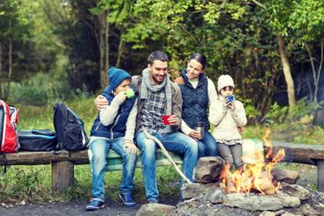

# Обществознание. Человек и его социальное окружение

## Тестиирование

### 01 - 414946

Одиннадцатиклассник Дима любит физику. Он много занимается, успешно участвует в конкурсах и олимпиадах, занимает призовые места. Какие качества Димы проявились в данной ситуации?

+1)  способности  
2) 	гениальность  
3) 	потребности  
4) 	задатки  

### 02 - 091547

Для иллюстрации какой социальной потребности человека может быть использована данная фотография? Объясните, почему эту потребность относят к социальным. Какие ещё потребности относят к этому виду? (Назовите любые две потребности.) Какова роль потребностей в жизни? 

Почему эту потребность относят к социальным:
- она возникает в процессе взаимодействия с другими людьми;
- связана с желанием быть принятым в группу, чувствовать поддержку и привязанность;
- удовлетворяет эмоциональную нужду в близости, доверии, чувстве «мы»;
- без её удовлетворения человек может испытывать одиночество, отчуждение, психологический дискомфорт 

Другие примеры социальных потребностей:
- Потребность в уважении и признании
- Потребность в дружбе

### 03 - 7B3D4A

Тимур – отец двоих детей, руководитель предприятия. В свободное время он тренирует дворовую футбольную команду. У Тимура много друзей, он общительный, энергичный человек. Обогащая таким образом собственный социальный опыт, Тимур развивается как
1) руководитель
2+) личность
3) индивид
4) член семьи

### 04 - CF854B

В приведенном списке указаны черты сходства человека с животным, а также черты различия человека от животных. Выберите и запишите в первую колонку таблицы порядковые номера черт сходства, а во вторую колонку – порядковые номера черт различия.
  	
1) необходимость поддержания теплового баланса тела
2) осознание собственных потребностей
3) создание нового, не имеющего аналогов в природе
4) потребность в пище и питье

Черты сходства: 1, 4  
Черты различия: 2, 3

### 05 - 67C94D

Сергей учится в 9 классе. Он очень ответственный и самостоятельный человек. Он занимается в кружке авиамоделирования и в хоккейной секции. Обогащая таким образом собственный социальный опыт, Сергей развивается как
1) индивид
2+) личность
3) потребитель
4) товарищ

### 06 - 89444F

Дмитрий – отец двоих детей, руководитель предприятия. В свободное время он тренирует дворовую футбольную команду. У Дмитрия много друзей, он общительный, энергичный человек. Обогащая таким образом собственный социальный опыт, Дмитрий развивается как
1) руководитель
2+) личность
3) работник
4) индивид

### 07 - 1F56FF

Таня хорошо учится в общеобразовательной школе, дополнительно занимается в художественной школе и секции фигурного катания. Она помогает родителям ухаживать за больной бабушкой. Обогащая таким образом собственный социальный опыт, Таня развивается как
1) индивид
2) гражданин
3+) личность
4) потребитель

### 08 - DF1901

Для иллюстрации какой идеальной (духовной) потребности человека может быть использована данная фотография? (Укажите наиболее общее, а не конкретное название.) Объясните, почему эту потребность относят к идеальным (духовным). Как Вы думаете, какие качества необходимы человеку для того, чтобы деятельность при удовлетворении данной потребности была успешной? Какие ещё потребности относят к данному виду? (Назовите любые две потребности.)

Ответ:
1. Потребность в познании (саморазвитии).
2. Относится к духовным — направлена на развитие интеллекта, не связана с физич. нуждами.
3. Качества: любознательность, усидчивость, аналитические способности, память.
4. Другие духовные потребности: приобщение к искусству, поиск смысла жизни.

### 09 - F77673

А. Человек –  социальное существо, многие его качества формируются только во взаимодействии с обществом.
Б. При рождении каждый человек обладает определёнными задатками, из которых при благоприятных условиях могут развиться способности.
1) верно только А
2) верно только Б
3+) верны оба суждения
4) оба суждения неверны

### 10 - 086675

Один из древних мыслителей рассуждал о потребностях человека: «…заботу о пище и уходе за телом нужно отнести к области здоровья и поддержания сил». О каких потребностях людей сказал мыслитель?
1+) естественных (биологических)
2) престижных
3) социальных
4) духовных